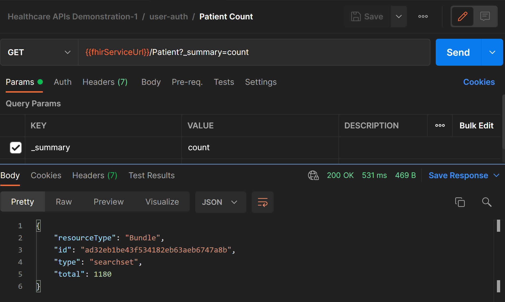

# Challenge-07 - FHIR service consent capabilities

## Introduction

Welcome to Challenge-07!

In this challenge, you will learn how to configure Consent Opt-Out filtering for the FHIR service using FHIR-Proxy (OSS).

## Background

In the digital transformation of healthcare, the wide adoption of FHIR R4 has removed certain barriers of access to patient health data. With this increased access, FHIR R4 also brings more control over what parties may gain access to patient data. Health institutions are required by law to guard patients' Personal Health Information (PHI), and one way this is managed is by requiring patient consent (either "broad" or "direct" consent) before practitioners or researchers may access a patient's medical records. In this challenge, we will be exploring capabilities in the Azure health data platform that make it possible for patients to opt out of sharing their FHIR records with certain parties.

## Learning Objectives for Challenge-07

+ Configure Consent Opt-Out filtering in FHIR-Proxy
+ Add a Consent Resource to the Healthcare APIs FHIR Service
+ Verify that Consent Opt-Out filtering performs as expected

## Prerequisites

+ Azure Health Data Services FHIR service instance with patient data
+ FHIR-Proxy successfully deployed
+ Postman (https://www.postman.com/downloads/) or Visual Studio Code with the REST Client extension (https://marketplace.visualstudio.com/items?itemName=humao.rest-client)
+ Multiple Azure AD users to simulate user and or administrator access to the FHIR service. 

## Step - 1 Configure Postman

1. Configure postman using the guidance provided in [Challenge 1](<../Challenge-01 - Deploy FHIR service (PaaS), FHIR-Proxy (OSS), and FHIR-Bulk Loader (OSS)/Readme.md>).
2. Confirm that the FHIR service contains Patient resources.

3. Select a Patient Resource and record the patient identifier. This will be used to create the Consent Resource.

Visual Studio Code with the [REST Client](https://marketplace.visualstudio.com/items?itemName=humao.rest-client) extension may also be used to complete this challenge. See the walkthrough [here](https://docs.microsoft.com/en-us/azure/healthcare-apis/fhir/using-rest-client) for details on how to use REST Client to access Azure Health Data Services FHIR service. Be sure to note that in all cases you will be using the FHIR-Proxy endpoint to complete this challenge.

## Step - 2 Post Consent Record to FHIR Service

1. Review and update (as needed) the sample Consent Resource, which may be found [here](./sample-data/consent-resource.json). Be sure to use the Patient Resource obtained in Step 1.
2. Create a new request in Postman and post the Consent Resource.

## Step - 3 Configure Secure FHIR Consent Opt-Out

1. Refer to the FHIR-Proxy configuration [documentation](https://github.com/microsoft/fhir-proxy/blob/main/docs/configuration.md) for additional details.
2. [Configure the Consent Opt Filter](https://github.com/microsoft/fhir-proxy/blob/main/docs/configuration.md). The FP-POST-PROCESSOR-TYPES must be updated to include FHIRProxy.postprocessors.ConsentOptOutFilter.
3. Additionally the FP-MOD-CONSENT-OPTOUT-CATEGORY setting with a value of `http://loinc.org|59284-0` must be added if it does not exist.

## Step - 3 Verify Consent Opt-Out filtering

1. Link a user to an appropriate FHIR resource. See the FHIR-Proxy configuration [documentation](https://github.com/microsoft/fhir-proxy/blob/main/docs/configuration.md) for additional details. Ensure that the linked user is not assigned to the FHIR-Proxy administrator role.

2. Sample query patient result. 

## What does success look like for Challenge-07?

+ Successfully POST a consent record to the Azure Health Data Services FHIR service
+ Verify that Consent Opt-Out properly filters resources

## Next Steps

Click [here](<../Challenge-08 - DICOM/Readme.md>) to proceed to the next challenge.
